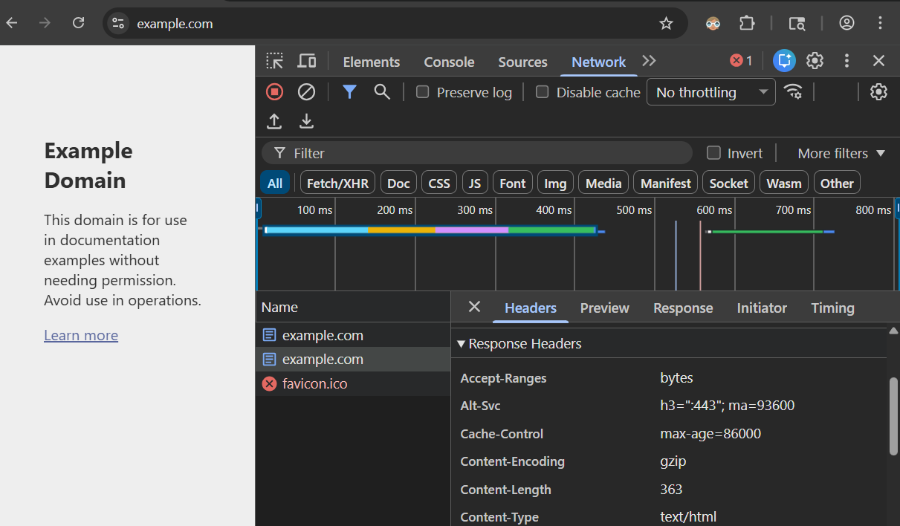
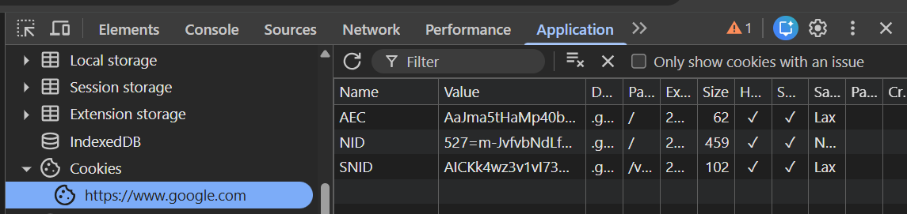

# Cookies

Cookies are a key-value store that is stored in the browser. They offer a way to automatically send data to the server with each request.

While they share much in common, here are some key differences between cookies and the JavaScript LocalStorage API that we have already seen:

| Feature       | Cookies                                   | LocalStorage                    |
| ------------- | ----------------------------------------- | ------------------------------- |
| Size          | Limited to ~4KB                           | ~5-10MB                         |
| Transmission  | Sent with every request (adding overhead) | Not sent to server              |
| Expiration    | Can have explicit expiration              | Persists until manually cleared |
| Accessibility | Can be accessed server-side               | Is JavaScript-only              |

To summarize:

- Cookies are for server-client communication
- LocalStorage is for client-only storage

## HTTP Headers

An HTTP Request / Response has two parts: the header and (optionally) the body. While the body contains the payload (the actual HTML, CSS, JS, image data, etc.), the header contains information about the request itself.

[HTTP headers](https://developer.mozilla.org/en-US/docs/Web/HTTP/Reference/Headers) are how the client and server send metadata with each request and response.

Try opening the developer tools in the browser and looking at the Network tab. You can see the request and response headers for each resource what was fetched.



## How the server sets cookies

The server sets cookies by sending a `Set-Cookie` header in the HTTP response.

```http
Set-Cookie: someKey=someValue; Path=/; Expires=Mon, 08 Dec 2025 13:27:17 GMT; HttpOnly
```

When the browser receives the `Set-Cookie` header, it will store the cookie in the browser.

You can view the cookies in the browser's developer tools by clicking the Application tab and then clicking the Cookies section.



## How the client sends cookies

The client sends cookies by sending a `Cookie` header in the HTTP request.

```http
Cookie: someKey=someValue
```

## Handling cookies in Node.js

Each programming language and library has a different way to set and access cookies. In Node.js we use the `cookie-parser` library to set up middleware that will automatically parse the cookies from the request header and make them available in the request object.

```js
import cookieParser from "cookie-parser";

// Adding middleware to the Express application...
app.use(cookieParser());

// ...
app.get("/", (req, res) => {
  const someValue = req.cookies.someKey;
  res.send(`Some Value: ${someValue}`);
});
```

## Security Considerations

Cookies are a powerful tool for server-client communication, but they can also be a security risk if not used correctly.

Here are some best practices to follow when using cookies:

- Use the `HttpOnly` flag to prevent JavaScript code from accessing the cookie.
- Use the `Secure` flag to only send the cookie over HTTPS.
  - Note: During development you will have to turn this off
- Use the `Max-Age` attribute to set a reasonable expiration time for the cookie.

## How to run the demo

- Navigate to: `http://localhost:3000/set-cookie?message=TEST` to set a cookie.
- Check your browser's developer tools to see the cookie set on the client.
- Navigate to: `http://localhost:3000/get-cookie` to show that the cookie is sent to the server.
- Navigate to: `http://localhost:3000/delete-cookie` to delete the cookie.
- Check your browser's developer tools to see the cookie has been deleted.
